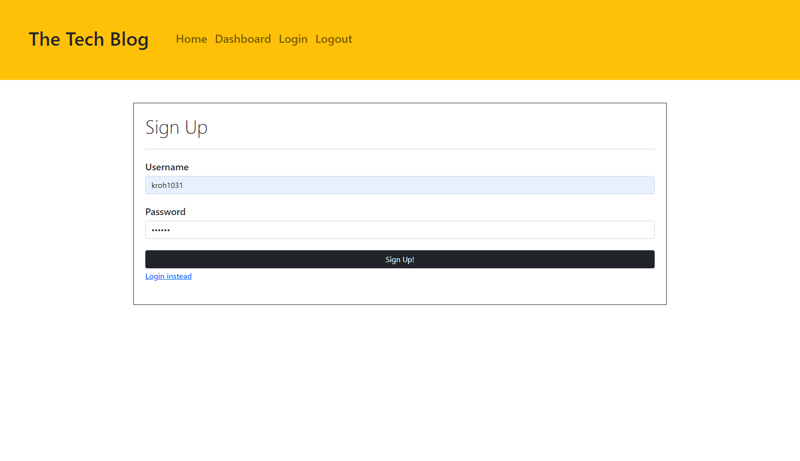
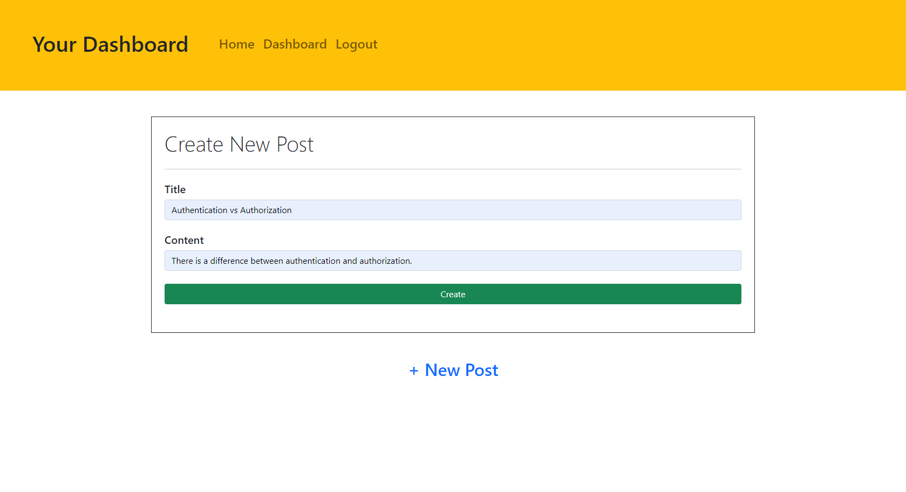
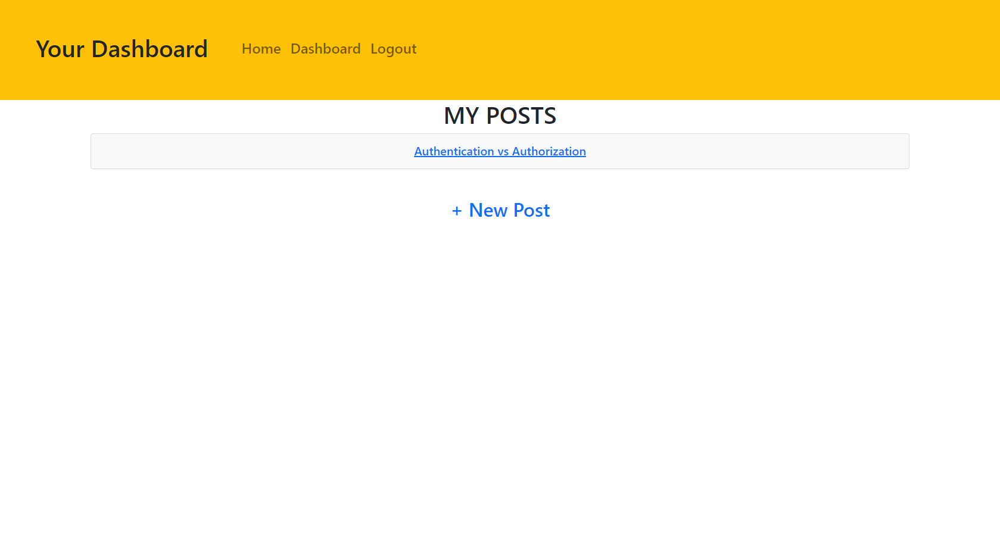
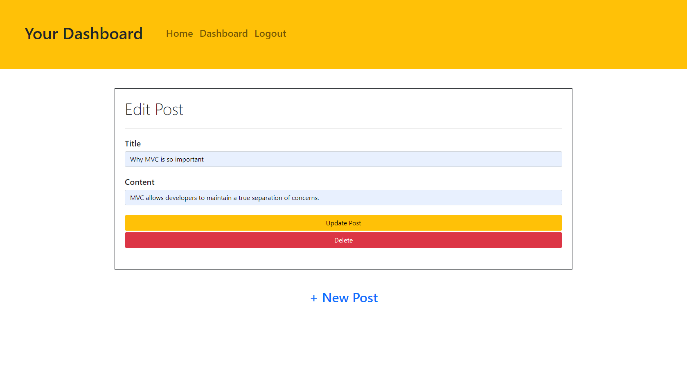
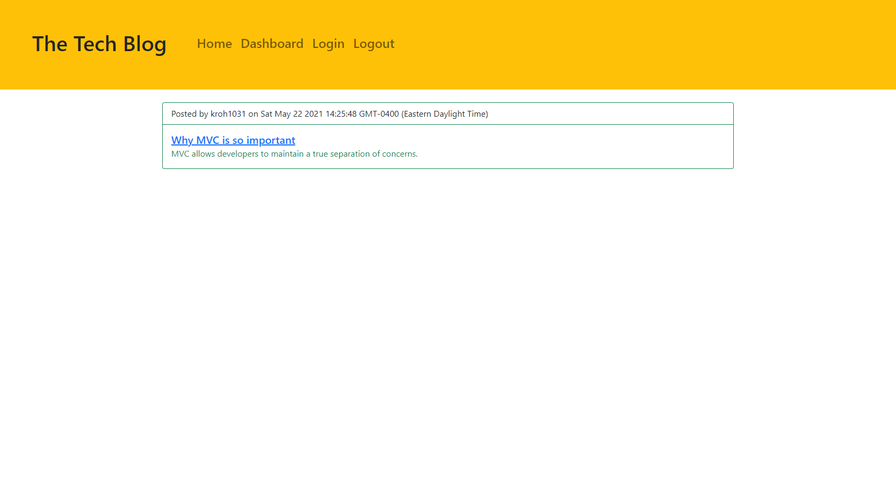

# 14 Model-View-Controller (MVC): Tech Blog

[](https://opensource.org/licenses/MIT)

## Description

[_Deployed Tech Blog Application!_](https://tech-blog-app14.herokuapp.com/)

This is a CMS-style blog site where developers can publish their blog posts and comment on other developers’ posts as well.  
It follows the MVC paradigm in its architectural structure, using Handlebars.js as the templating language, Sequelize as the ORM, and the express-session npm package for authentication.

## Table of Contents

- [Installation](#installation)

- [Usage](#usage)

- [License](#license)

- [Mock-Up](#mock-up)

- [Questions](#questions)

## Installation

To install necessary dependencies, run the following command:

```
npm i
```

## Usage

To launch the application, run the following command:

```
npm start
```

## License

This project is licensed under the MIT license.  
https://opensource.org/licenses/MIT

## Mock-Up

The following images show the web application's appearance and functionality:

**Sign up page:**


**Creating a new post in dashboard:**


**User's posts:**


**Edit/Delete an existing post:**


**All existing posts:**


## Questions

If you have any questions about the repo, open an issue or contact me directly at karenroh@hotmail.com.  
 You can find more of my work at [kroh1031](https://github.com/kroh1031).
